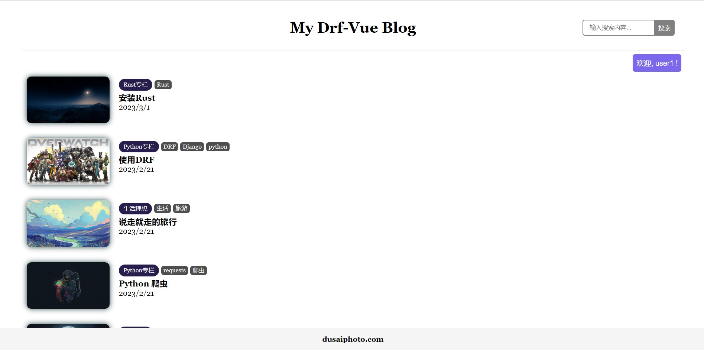

# 个人博客(Django4+Vue3)

👉[原教程传送](https://www.dusaiphoto.com/article/103/).


## 预览



## 环境配置

1. [安装Pyhton](https://www.python.org/) (version >= 3.10)

	- pip install Django==4.1.5
	- pip install djangorestframework==3.14.0
	- pip install django-cors-headers==3.13.0
	- pip install markdown==3.4.1
	- pip install django-filter==22.1
	- pip install djangorestframework-simplejwt==5.2.2

2. [安装nodejs](https://nodejs.org/en/) (version == 18.14.0)

- npm install -g @vue/cli

## 快速开始

### 前提

cd到 `blog_dv` 文件夹下，依次执行以下命令，完成数据库的迁移：

```shell
python manage.py makemigrations
python manage.py migrate
```

创建超级用户：

```shell
python manage.py createsuperuser  # 按提示创建超级用户
```

然后cd到 `frontend` 文件夹下，执行以下命令：

```shell
npm install
npm i vue-router@4
npm i axios
```

### 启动

1. 进入 blog_dv 目录下，打开终端输入：`python manage.py runserver` 

2. 进入 frontend 目录下，打开一个新的终端：`npm run dev`
3. 打开浏览器，输入地址：http://localhost:8080/
4. 完成！


## 其他

博客还有许多不完善的地方...... 需要修改
